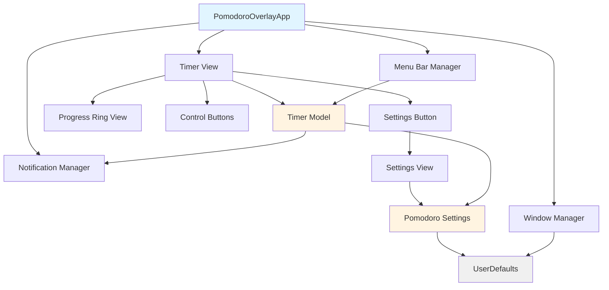
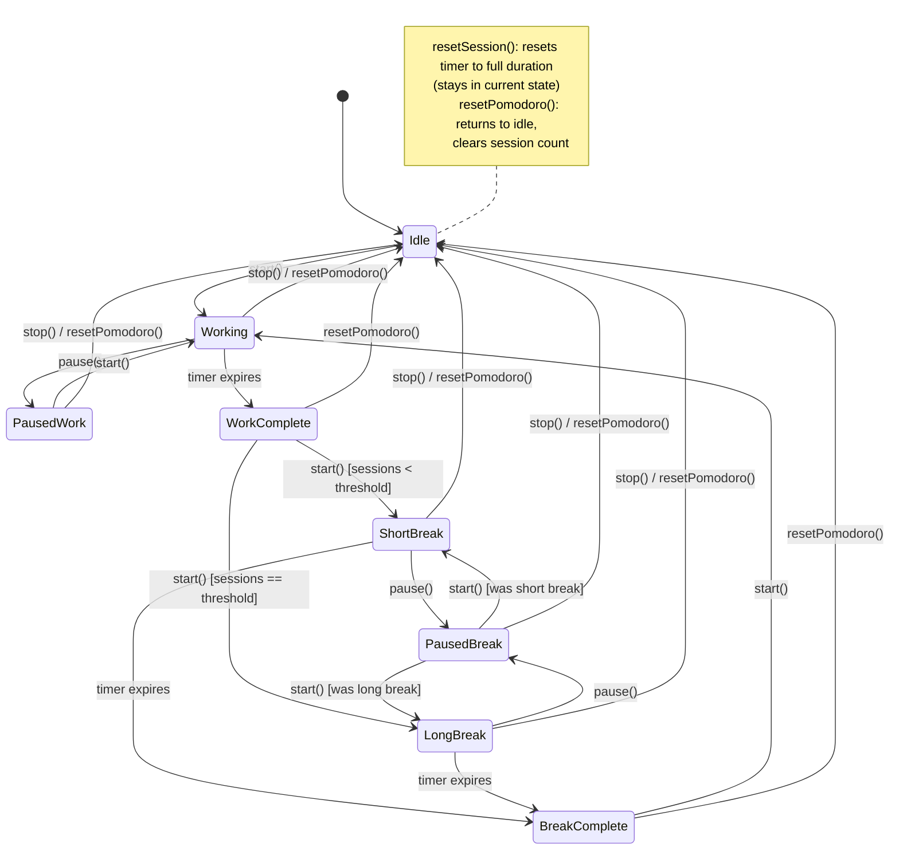
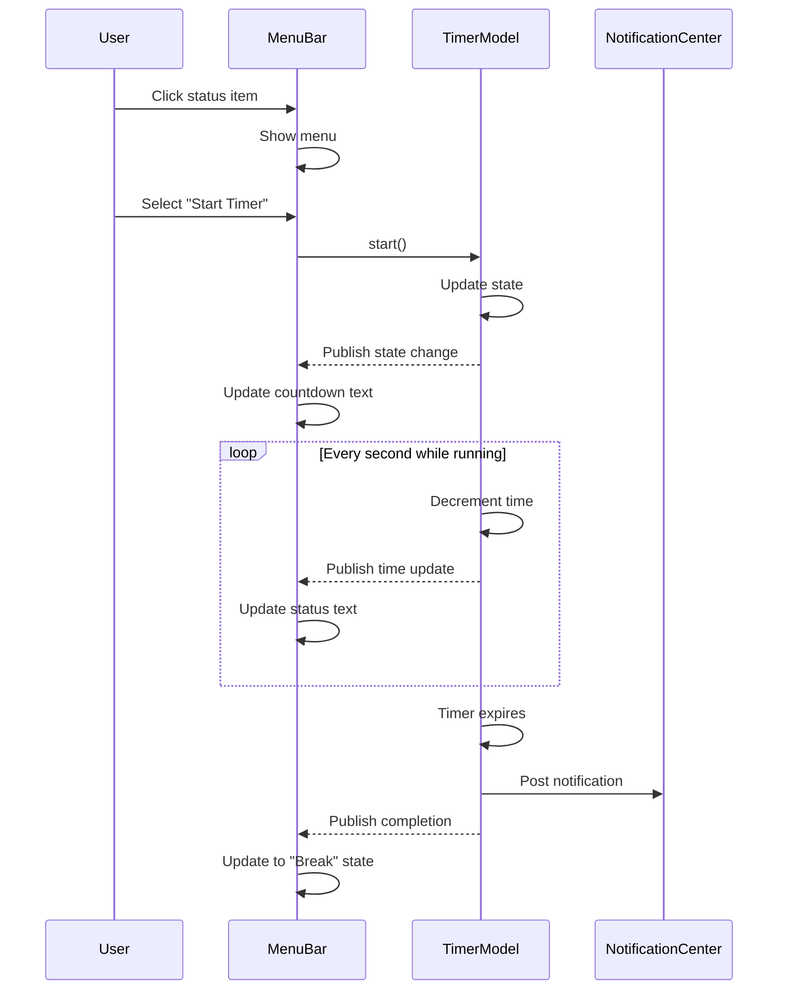
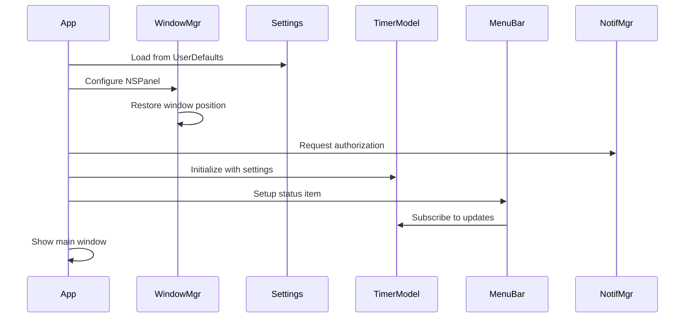
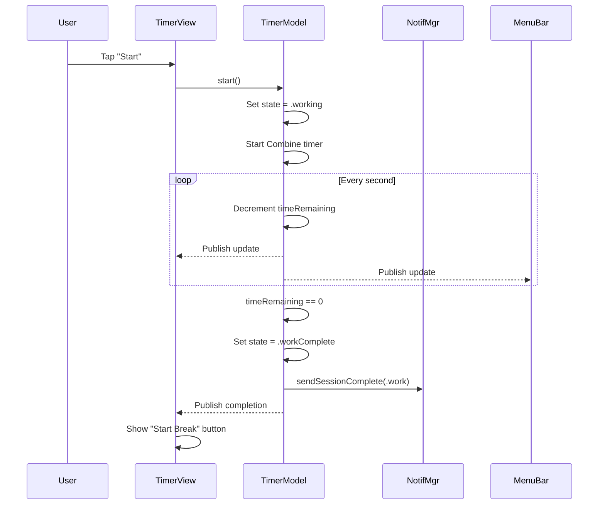
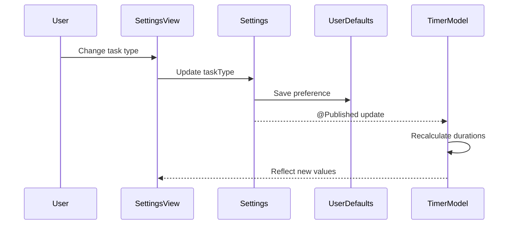
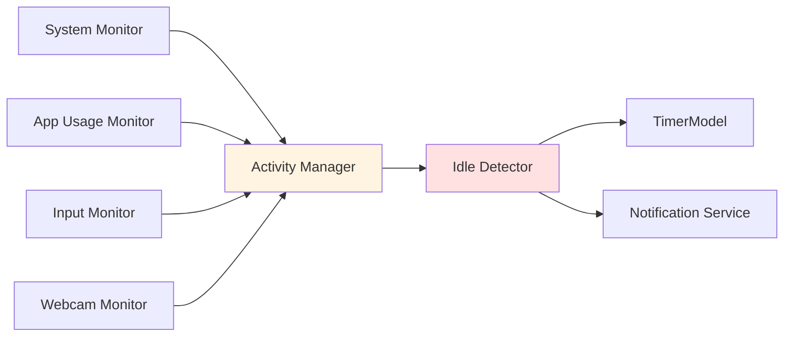

# ARCHITECTURE — Pomodoro Overlay

> Last updated: 2026-01-13

---

## System Overview

Pomodoro Overlay is a native macOS application built with SwiftUI and AppKit, designed as an always-visible, non-intrusive productivity timer. The architecture prioritizes lightweight state management, reliable window positioning, and seamless integration with macOS notification and menu bar systems.

**Core principle**: Single-window application with persistent floating panel, minimal dependencies, and reactive state updates.

---

## Component Map



### Component Responsibilities

| Component | Responsibility | Dependencies |
|-----------|---------------|--------------|
| **PomodoroOverlayApp** | App lifecycle, window setup, initialization | WindowManager, NotificationManager |
| **WindowManager** | NSPanel configuration, position persistence | UserDefaults |
| **TimerModel** | State machine, countdown logic, session tracking | PomodoroSettings, NotificationManager |
| **PomodoroSettings** | Task type selection, duration config, UI prefs | UserDefaults |
| **TimerView** | Main UI container, layout orchestration | TimerModel, ProgressRingView, ControlButtons |
| **ProgressRingView** | Circular progress visualization | TimerModel (read-only) |
| **ControlButtons** | Start/pause/stop/reset button actions | TimerModel (commands) |
| **SettingsView** | Preferences UI, task type selection | PomodoroSettings |
| **MenuBarManager** | Menu bar icon, live countdown, quick actions | TimerModel |
| **NotificationManager** | System notification delivery | UNUserNotificationCenter |

---

## Data Models

### PomodoroSettings

```swift
struct PomodoroSettings {
    // task type
    enum TaskType: String, CaseIterable {
        case admin, study, deep, creative
        
        var workMinutes: Int { /* lookup table */ }
        var shortBreakMinutes: Int { /* lookup table */ }
        var longBreakMinutes: Int { /* lookup table */ }
        var sessionsBeforeLong: Int { /* lookup table */ }
    }
    
    // persisted preferences
    @AppStorage("selectedTaskType") var taskType: TaskType = .study
    @AppStorage("windowOpacity") var opacity: Double = 0.9
    @AppStorage("fontSize") var fontSize: Double = 24.0
    @AppStorage("windowFrame") var windowFrame: Data? = nil
}
```

**Duration Lookup Table**:
```
| TaskType | work_min | short_break | sessions_before_long | long_break |
|----------|----------|-------------|----------------------|------------|
| ADMIN    | 20       | 5           | 3                    | 15         |
| STUDY    | 25       | 5           | 4                    | 25         |
| DEEP     | 45       | 10          | 3                    | 40         |
| CREATIVE | 60       | 15          | 2                    | 60         |
```

### TimerModel

```swift
class TimerModel: ObservableObject {
    // published state
    @Published var currentState: TimerState
    @Published var timeRemaining: TimeInterval
    @Published var completedSessions: Int
    @Published var totalSessionsInCycle: Int
    
    // state machine
    enum TimerState {
        case idle
        case working(startTime: Date)
        case paused(remainingTime: TimeInterval, wasWorking: Bool)
        case workComplete
        case shortBreak(startTime: Date)
        case longBreak(startTime: Date)
        case breakComplete
    }
    
    // commands
    func start()
    func pause()
    func stop()
    func resetSession()
    func resetPomodoro()
}
```

---

## State Machine



### State Transitions

| From | Event | To | Side Effects |
|------|-------|-----|--------------|
| Idle | start() | Working | Start timer, reset session counter if new cycle |
| Working | pause() | Paused(working) | Store remaining time |
| Working | timer expires | WorkComplete | Increment session count, send notification |
| Working | stop() | Idle | Clear current session, preserve session count |
| Paused | start() | Working/Break | Resume with stored time |
| Paused | stop() | Idle | Clear paused time |
| WorkComplete | start() | ShortBreak/LongBreak | Check session count threshold |
| ShortBreak | timer expires | BreakComplete | Send notification |
| LongBreak | timer expires | BreakComplete | Send notification, reset session count |
| BreakComplete | start() | Working | Begin next work session |
| Any | resetSession() | Same state | Reset timer to full duration for current phase |
| Any | resetPomodoro() | Idle | Clear all state, reset session count to 0 |

---

## Window Management

### NSPanel Configuration

```swift
class WindowManager {
    func configureOverlayWindow(_ window: NSWindow) {
        // always on top
        window.level = .floating
        window.collectionBehavior = [.canJoinAllSpaces, .fullScreenAuxiliary]
        
        // non-activating (doesn't steal focus)
        (window as? NSPanel)?.isFloatingPanel = true
        (window as? NSPanel)?.becomesKeyOnlyIfNeeded = true
        
        // visual style
        window.isOpaque = false
        window.backgroundColor = .clear
        window.hasShadow = true
        
        // standard controls
        window.styleMask = [.titled, .closable, .resizable]
        window.titleVisibility = .hidden
        window.titlebarAppearsTransparent = true
        
        // sizing constraints
        window.minSize = CGSize(width: 200, height: 200)
        window.maxSize = CGSize(width: 600, height: 600)
    }
}
```

### Position Persistence

```swift
extension WindowManager {
    func saveWindowFrame(_ frame: NSRect) {
        let frameData = try? NSKeyedArchiver.archivedData(
            withRootObject: NSStringFromRect(frame), 
            requiringSecureCoding: false
        )
        UserDefaults.standard.set(frameData, forKey: "windowFrame")
    }
    
    func restoreWindowFrame() -> NSRect? {
        guard let data = UserDefaults.standard.data(forKey: "windowFrame"),
              let frameString = try? NSKeyedUnarchiver.unarchivedObject(
                  ofClass: NSString.self, 
                  from: data
              ) else { return nil }
        
        let frame = NSRectFromString(frameString as String)
        
        // validate frame is on screen
        return NSScreen.screens.contains { $0.visibleFrame.intersects(frame) }
            ? frame 
            : nil
    }
}
```

**Multi-monitor handling**:
- On app launch, check if saved frame intersects any visible screen
- If off-screen (monitor disconnected), center on main screen
- Window dragged to new monitor saves new position immediately

---

## UI Architecture

### View Hierarchy

```
PomodoroOverlayApp
└── WindowGroup
    └── TimerView (main container)
        ├── VStack
        │   ├── TaskTypeLabel
        │   ├── ProgressRingView
        │   │   └── ZStack
        │   │       ├── Circle (background track)
        │   │       ├── Circle (progress arc)
        │   │       └── VStack
        │   │           ├── TimeDisplay (mm:ss)
        │   │           └── SessionCounter (3/4)
        │   ├── ControlButtonsView
        │   │   ├── HStack
        │   │   │   ├── StartButton / PauseButton
        │   │   │   ├── StopButton
        │   │   │   └── Menu (Reset Options)
        │   └── SettingsButton
        └── .sheet(SettingsView)
```

### ProgressRingView

```swift
struct ProgressRingView: View {
    @ObservedObject var timerModel: TimerModel
    let lineWidth: CGFloat = 12
    
    var progress: Double {
        guard timerModel.totalDuration > 0 else { return 0 }
        return 1.0 - (timerModel.timeRemaining / timerModel.totalDuration)
    }
    
    var body: some View {
        ZStack {
            // background track
            Circle()
                .stroke(Color.gray.opacity(0.2), lineWidth: lineWidth)
            
            // progress arc
            Circle()
                .trim(from: 0, to: progress)
                .stroke(timerModel.isWorking ? Color.red : Color.green, 
                       style: StrokeStyle(lineWidth: lineWidth, lineCap: .round))
                .rotationEffect(.degrees(-90))
                .animation(.linear(duration: 1), value: progress)
            
            // center content
            VStack {
                Text(timerModel.timeRemainingFormatted)
                    .font(.system(size: fontSize, weight: .bold, design: .monospaced))
                Text("\(timerModel.completedSessions)/\(timerModel.totalSessionsInCycle)")
                    .font(.caption)
                    .foregroundColor(.secondary)
            }
        }
        .aspectRatio(1, contentMode: .fit)
    }
}
```

### Transparency and Blur

```swift
struct TimerView: View {
    var body: some View {
        ZStack {
            // blur background
            RoundedRectangle(cornerRadius: 16)
                .fill(.ultraThinMaterial)
                .opacity(settings.opacity)
            
            // content
            VStack { /* ... */ }
                .padding()
        }
        .frame(minWidth: 200, minHeight: 200)
    }
}
```

---

## Menu Bar Integration



### MenuBarManager

```swift
class MenuBarManager: ObservableObject {
    private var statusItem: NSStatusItem?
    private var timerModel: TimerModel
    private var cancellables = Set<AnyCancellable>()
    
    func setup() {
        statusItem = NSStatusBar.system.statusItem(
            withLength: NSStatusItem.variableLength
        )
        
        // subscribe to timer updates
        timerModel.$timeRemaining
            .sink { [weak self] time in
                self?.updateStatusText(time)
            }
            .store(in: &cancellables)
        
        // context menu
        let menu = NSMenu()
        menu.addItem(NSMenuItem(title: "Start", action: #selector(startTimer), keyEquivalent: "s"))
        menu.addItem(NSMenuItem(title: "Pause", action: #selector(pauseTimer), keyEquivalent: "p"))
        menu.addItem(.separator())
        menu.addItem(NSMenuItem(title: "Settings...", action: #selector(showSettings), keyEquivalent: ","))
        statusItem?.menu = menu
    }
    
    private func updateStatusText(_ timeRemaining: TimeInterval) {
        let minutes = Int(timeRemaining) / 60
        let seconds = Int(timeRemaining) % 60
        statusItem?.button?.title = String(format: "%02d:%02d", minutes, seconds)
    }
}
```

---

## Notification System

### NotificationManager

```swift
class NotificationManager {
    static let shared = NotificationManager()
    
    func requestAuthorization() async -> Bool {
        let center = UNUserNotificationCenter.current()
        do {
            return try await center.requestAuthorization(options: [.alert, .sound])
        } catch {
            return false
        }
    }
    
    func sendSessionComplete(type: SessionType) {
        let content = UNMutableNotificationContent()
        content.title = "Pomodoro Timer"
        content.body = type == .work 
            ? "Work session complete! Time for a break." 
            : "Break over! Ready to focus?"
        content.sound = .default
        content.categoryIdentifier = "SESSION_COMPLETE"
        
        let request = UNNotificationRequest(
            identifier: UUID().uuidString,
            content: content,
            trigger: nil // deliver immediately
        )
        
        UNUserNotificationCenter.current().add(request)
    }
}

enum SessionType {
    case work, shortBreak, longBreak
}
```

### Notification Categories

```swift
func setupNotificationCategories() {
    let startAction = UNNotificationAction(
        identifier: "START_NEXT",
        title: "Start Next Session",
        options: .foreground
    )
    
    let skipAction = UNNotificationAction(
        identifier: "SKIP_BREAK",
        title: "Skip Break",
        options: .foreground
    )
    
    let category = UNNotificationCategory(
        identifier: "SESSION_COMPLETE",
        actions: [startAction, skipAction],
        intentIdentifiers: []
    )
    
    UNUserNotificationCenter.current().setNotificationCategories([category])
}
```

---

## Data Flow

### Startup Sequence



### Timer Lifecycle



### Settings Update Flow



---

## Persistence Strategy

### UserDefaults Keys

| Key | Type | Purpose |
|-----|------|---------|
| `selectedTaskType` | String | Current task type (admin/study/deep/creative) |
| `windowOpacity` | Double | Transparency level (0.5-1.0) |
| `fontSize` | Double | Timer display font size (18-48) |
| `windowFrame` | Data | Encoded NSRect for window position |
| `lastSessionCount` | Int | Completed sessions (for recovery after crash) |

### State Recovery

On app restart:
1. Load `selectedTaskType` → restore task configuration
2. Load `windowFrame` → restore position (validate on-screen)
3. Load UI preferences → apply opacity and font size
4. **Do not** restore mid-session timer state (always start in `.idle`)

**Rationale**: Restoring active timers introduces complexity and inaccuracy (elapsed time during closure). Better UX to always start fresh.

---

## Error Handling

### Failure Scenarios

| Scenario | Detection | Recovery |
|----------|-----------|----------|
| Notification permission denied | Check `requestAuthorization()` result | Show alert, continue without notifications |
| Window off-screen (monitor unplugged) | Check frame intersection with screens | Reset to centered on main screen |
| Corrupt UserDefaults data | Decoding throws exception | Catch, log, use default values |
| App force-quit during session | No state saved | Start fresh in `.idle` on next launch |

### Logging Strategy

```swift
import OSLog

extension Logger {
    static let timer = Logger(subsystem: "com.pomodoro.overlay", category: "timer")
    static let window = Logger(subsystem: "com.pomodoro.overlay", category: "window")
    static let notifications = Logger(subsystem: "com.pomodoro.overlay", category: "notifications")
}

// usage
Logger.timer.info("Starting work session: \(settings.taskType.rawValue)")
Logger.window.debug("Window frame saved: \(windowFrame)")
```

---

## Performance Considerations

### CPU Usage
- Combine timer updates at 1-second intervals (not per-frame)
- Menu bar text updates throttled to 1 Hz
- SwiftUI animations use `.linear` to avoid easing calculations

### Memory Footprint
- Single timer instance (no background threads)
- Minimal object graph (< 50MB typical)
- No image assets beyond app icon
- No caching layer needed (stateless UI)

### Battery Impact
- Timer fires via `Timer.publish().autoconnect()` (coalesced by system)
- No location services, networking, or background tasks
- Floating window uses hardware-accelerated compositing

---

## Security and Privacy

### Data Collection
**None.** All data stored locally in UserDefaults. No analytics, telemetry, or network requests.

### Permissions Required
- **Notifications**: Optional, requested on first launch
- **Accessibility**: Not required for core functionality
- **Screen Recording**: Not required (no screenshots/recordings)

### Sandbox Compatibility
App is fully sandboxed:
- No file system access beyond container
- No inter-process communication
- No dynamic code execution

---

## Testing Strategy

### Unit Tests
- `TimerModelTests`: State machine transitions, duration calculations
- `PomodoroSettingsTests`: Duration lookup correctness
- `WindowManagerTests`: Frame encoding/decoding, on-screen validation

### Integration Tests
- Full pomodoro cycle (work → short break → work × N → long break)
- Settings changes applied immediately to active timer
- Notification delivery at session boundaries

### Manual Testing
- Multi-monitor positioning (drag to external display)
- Mission Control behavior (window stays visible)
- Fullscreen app overlay (window floats above)
- Mac sleep/wake (timer paused or continued?)
- Force quit recovery (clean restart)

---

## Deployment Architecture

### Build Configuration

```swift
// Info.plist
<key>LSUIElement</key>
<true/>  // Optional: hide from Dock (menu bar app only)

<key>NSUserNotificationAlertStyle</key>
<string>alert</string>

<key>LSMinimumSystemVersion</key>
<string>13.0</string>
```

### Distribution

1. **Build universal binary**:
   ```bash
   xcodebuild -scheme PomodoroOverlay \
              -configuration Release \
              -archivePath PomodoroOverlay.xcarchive \
              archive
   ```

2. **Export for distribution**:
   ```bash
   xcodebuild -exportArchive \
              -archivePath PomodoroOverlay.xcarchive \
              -exportPath Release \
              -exportOptionsPlist ExportOptions.plist
   ```

3. **Notarize** (for Gatekeeper):
   ```bash
   xcrun notarytool submit PomodoroOverlay.zip \
                           --apple-id <email> \
                           --team-id <team> \
                           --password <app-specific-password>
   ```

4. **Create DMG**:
   ```bash
   hdiutil create -volname "Pomodoro Overlay" \
                  -srcfolder Release/ \
                  -ov -format UDZO \
                  PomodoroOverlay.dmg
   ```

---

## Future Architecture Considerations

### Idle Detection System (Post-v1.0)



**Components**:
- `SystemMonitor`: Track active app using `NSWorkspace.shared.frontmostApplication`
- `InputMonitor`: Listen for mouse/keyboard events via `CGEvent.tapCreate()`
- `WebcamMonitor`: Run CoreML model to detect phone in frame
- `IdleDetector`: Aggregate signals, trigger notifications if idle > 20s

**Permissions needed**:
- Accessibility (for input monitoring)
- Camera (for webcam detection)

### Siri Integration (Post-v1.0)

Use `AppIntents` framework:
```swift
struct StartPomodoroIntent: AppIntent {
    static var title: LocalizedStringResource = "Start Pomodoro"
    
    func perform() async throws -> some IntentResult {
        await TimerModel.shared.start()
        return .result()
    }
}
```

**Siri commands**:
- "Start pomodoro"
- "Pause pomodoro"
- "How much time left?"
- "Skip break"

---

*End of architecture document.*
