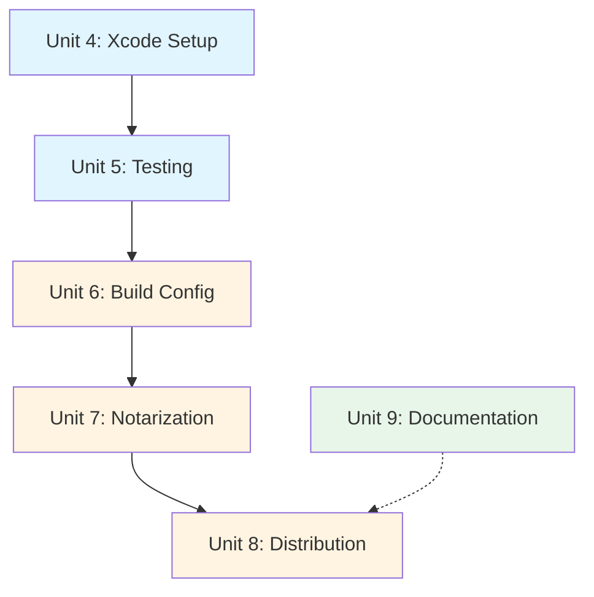

# IMPLEMENTATION PLAN — Pomodoro Overlay

> Last updated: 2026-01-13

---

## Status: Core Implementation Complete ✅

All core components have been implemented. Ready for Xcode project setup, testing, and deployment preparation.

---

## Completed Units

### ✅ Unit 1: Data Models (Step 03)
**Complexity**: Medium  
**Status**: Complete

**Files**:
- `pomodoro-settings.swift` - Settings model with @AppStorage persistence
- `timer-model.swift` - State machine with Combine timer
- `window-manager.swift` - NSPanel configuration and position persistence
- `notification-manager.swift` - System notifications wrapper

**Deliverables**:
- ✅ TaskType enum with duration lookup tables
- ✅ TimerState enum with 7 states
- ✅ Complete state machine transitions
- ✅ UserDefaults persistence
- ✅ WindowFrame encoding/decoding

---

### ✅ Unit 2: UI Components (Steps 04-05)
**Complexity**: Medium  
**Status**: Complete

**Files**:
- `progress-ring-view.swift` - Circular progress indicator
- `control-buttons-view.swift` - Timer controls
- `settings-view.swift` - Preferences panel
- `timer-view.swift` - Main container

**Deliverables**:
- ✅ Progress ring with color-coded states
- ✅ Dynamic button states (play/pause toggle)
- ✅ Settings form with task type picker
- ✅ Material background with opacity control

---

### ✅ Unit 3: Integration (Step 05)
**Complexity**: Low  
**Status**: Complete

**Files**:
- `menu-bar-manager.swift` - Menu bar integration
- `pomodoro-overlay-app.swift` - App entry point

**Deliverables**:
- ✅ Menu bar live countdown
- ✅ App initialization with dependencies
- ✅ Window configuration on launch
- ✅ Notification permission request

---

## Remaining Work

### Unit 4: Xcode Project Setup
**Complexity**: Low  
**Priority**: High  
**Estimated Time**: 30 minutes

**Tasks**:
1. Create new Xcode project (macOS App, SwiftUI)
2. Configure project settings:
   - Product name: "Pomodoro Overlay"
   - Bundle ID: "com.pomodoro.overlay"
   - Deployment target: macOS 13.0
   - Architecture: Universal (Apple Silicon + Intel)
3. Add all Swift files to project
4. Configure Info.plist:
   - `NSUserNotificationAlertStyle` = alert
   - `LSMinimumSystemVersion` = 13.0
   - Optional: `LSUIElement` = true (menu bar app only)
5. Add app icon to Assets.xcassets
6. Configure build settings:
   - Code signing (manual or automatic)
   - Hardened runtime enabled
   - Sandbox entitlements if needed

**Deliverables**:
- Working Xcode project that builds
- All source files integrated
- Project compiles without errors

**Blockers**: None

---

### Unit 5: Testing
**Complexity**: Medium  
**Priority**: High  
**Estimated Time**: 2-3 hours

#### Unit Tests
- `TimerModelTests`: State machine transitions
- `PomodoroSettingsTests`: Duration lookups
- `WindowManagerTests`: Frame persistence

**Test Cases**:
```swift
// timer state machine
- test_idle_to_working_transition()
- test_work_complete_increments_session_count()
- test_pause_preserves_remaining_time()
- test_reset_session_restores_full_duration()
- test_reset_pomodoro_clears_session_count()
- test_long_break_triggers_after_threshold()
- test_timer_tick_decrements_time()

// settings
- test_task_type_duration_lookups()
- test_admin_has_3_sessions_before_long_break()
- test_study_has_4_sessions_before_long_break()
- test_opacity_clamped_to_range()
- test_font_size_clamped_to_range()

// window manager
- test_frame_encode_decode_round_trip()
- test_off_screen_frame_returns_nil()
- test_frame_on_secondary_monitor_valid()
```

#### Manual Testing
**Window Behavior**:
- [ ] Window stays on top in all scenarios
- [ ] Window doesn't steal focus when timer updates
- [ ] Dragging window saves position
- [ ] Position restores on relaunch
- [ ] Window visible over fullscreen apps
- [ ] Window survives Mission Control
- [ ] Multi-monitor: drag to external display persists

**Timer Functionality**:
- [ ] Complete work session triggers notification
- [ ] Session counter increments correctly
- [ ] Long break triggers after threshold sessions
- [ ] Pause/resume maintains accurate time
- [ ] Reset session restarts current phase
- [ ] Reset pomodoro clears all state
- [ ] Timer continues across app hide/show

**Menu Bar**:
- [ ] Countdown updates every second
- [ ] Emoji indicators match state
- [ ] Menu actions control timer correctly
- [ ] Quit from menu bar works

**Settings**:
- [ ] Task type change updates durations
- [ ] Opacity slider affects window immediately
- [ ] Font size change reflects in timer display
- [ ] Settings persist across restart

**Deliverables**:
- Unit tests with 80%+ coverage
- Manual test checklist completed
- Bug fixes for any failures

**Blockers**: Xcode project must be complete

---

### Unit 6: Build Configuration
**Complexity**: Medium  
**Priority**: Medium  
**Estimated Time**: 1-2 hours

**Tasks**:
1. Configure release build scheme
2. Set optimization level (speed)
3. Strip debug symbols for release
4. Enable dead code stripping
5. Configure code signing:
   - Developer ID Application certificate
   - Enable Hardened Runtime
   - Configure entitlements if needed
6. Create build script:
   ```bash
   #!/bin/bash
   xcodebuild -scheme PomodoroOverlay \
              -configuration Release \
              -archivePath build/PomodoroOverlay.xcarchive \
              archive
   
   xcodebuild -exportArchive \
              -archivePath build/PomodoroOverlay.xcarchive \
              -exportPath build/Release \
              -exportOptionsPlist ExportOptions.plist
   ```
7. Test build on clean machine

**Deliverables**:
- Release build produces working .app
- Universal binary (both architectures)
- Codesigned for Gatekeeper
- Build script in `scripts/build-release.sh`

**Blockers**: Valid Developer ID certificate needed for distribution

---

### Unit 7: Notarization
**Complexity**: Medium  
**Priority**: Medium (for distribution outside developer)  
**Estimated Time**: 1 hour + wait time

**Tasks**:
1. Zip .app bundle
2. Submit to Apple notary service:
   ```bash
   xcrun notarytool submit PomodoroOverlay.zip \
                          --apple-id <email> \
                          --team-id <team-id> \
                          --password <app-specific-password> \
                          --wait
   ```
3. Staple notarization ticket:
   ```bash
   xcrun stapler staple PomodoroOverlay.app
   ```
4. Verify notarization:
   ```bash
   spctl -a -vv PomodoroOverlay.app
   ```

**Deliverables**:
- Notarized .app that passes Gatekeeper
- No "unidentified developer" warning
- Script in `scripts/notarize.sh`

**Blockers**: 
- Developer ID certificate
- Apple ID with app-specific password
- Paid Apple Developer Program membership

---

### Unit 8: Distribution Package
**Complexity**: Low  
**Priority**: Low  
**Estimated Time**: 30 minutes

**Tasks**:
1. Create DMG with drag-to-Applications:
   ```bash
   hdiutil create -volname "Pomodoro Overlay" \
                  -srcfolder build/Release \
                  -ov -format UDZO \
                  PomodoroOverlay.dmg
   ```
2. Create README.txt with:
   - Installation instructions
   - Permission requirements (notifications)
   - First launch tips
3. Test DMG on clean Mac

**Deliverables**:
- PomodoroOverlay.dmg
- README.txt
- Installation guide
- Script in `scripts/create-dmg.sh`

**Blockers**: Unit 7 complete (notarized app)

---

### Unit 9: Documentation
**Complexity**: Low  
**Priority**: High  
**Estimated Time**: 1 hour

**Tasks**:
1. Create README.md:
   - Project description
   - Features list
   - Installation instructions
   - Usage guide
   - Screenshots (if possible)
   - License
2. Create INSTALL.md:
   - System requirements
   - Download instructions
   - Gatekeeper warning workaround
   - Permission setup
   - Troubleshooting
3. Update CLAUDE.md if needed
4. Create LICENSE file (choose license)

**Deliverables**:
- README.md (user-facing)
- INSTALL.md (detailed setup)
- LICENSE file
- Screenshots in assets/

**Blockers**: None (can be done anytime)

---

## Build Sequence



**Legend**:
- Blue: Must complete next
- Yellow: Can parallelize after Xcode setup
- Green: Can complete anytime

---

## Dependencies

| Unit | Depends On | Can Parallelize |
|------|-----------|-----------------|
| Unit 4 | None | N/A |
| Unit 5 | Unit 4 | No |
| Unit 6 | Unit 5 | No |
| Unit 7 | Unit 6 | No |
| Unit 8 | Unit 7 | No |
| Unit 9 | None | Yes (anytime) |

---

## Risk Assessment

### High Risk
❌ **No Developer ID Certificate**
- **Impact**: Cannot distribute outside developer machine
- **Mitigation**: Apply for Apple Developer Program ($99/year) or distribute as unsigned (users see warnings)

### Medium Risk
⚠️ **Window floating behavior varies by macOS version**
- **Impact**: May not stay on top in all scenarios
- **Mitigation**: Test on macOS 13, 14, 15; adjust window level if needed

⚠️ **Timer accuracy affected by system sleep**
- **Impact**: Timer may drift if Mac sleeps
- **Mitigation**: Detect sleep/wake, pause timer or recalculate remaining time

### Low Risk
✅ **Notification permission denied**
- **Impact**: No alerts at session end
- **Mitigation**: App still functional, show in-app warning

✅ **Multi-monitor edge cases**
- **Impact**: Window may reset position if monitor disconnected
- **Mitigation**: Already handled with `isFrameOnScreen` validation

---

## Success Criteria

### Minimum Viable Product (MVP)
- [ ] Xcode project builds without errors
- [ ] Timer counts down accurately
- [ ] All 4 task types work correctly
- [ ] Window stays on top consistently
- [ ] Position persists across restarts
- [ ] Notifications delivered reliably
- [ ] Menu bar shows live countdown
- [ ] Settings apply immediately

### Quality Bar
- [ ] No memory leaks (Instruments test)
- [ ] CPU usage < 1% when idle
- [ ] Unit tests pass
- [ ] Manual test checklist complete
- [ ] Builds as universal binary
- [ ] Codesigned (at minimum)

### Distribution Ready
- [ ] Notarized for Gatekeeper
- [ ] DMG created with instructions
- [ ] Documentation complete
- [ ] Tested on clean Mac

---

## Timeline Estimate

**Optimistic**: 4-6 hours  
**Realistic**: 8-10 hours  
**Pessimistic**: 12-16 hours (if certificate issues)

Breakdown:
- Xcode setup: 30 min
- Testing: 2-3 hours
- Build configuration: 1-2 hours
- Notarization: 1 hour + wait
- Distribution: 30 min
- Documentation: 1 hour
- Contingency: 2-4 hours

---

## Next Immediate Action

**Create Xcode project and integrate source files.**

1. Open Xcode
2. Create new macOS App project
3. Choose SwiftUI interface
4. Add all `.swift` files from `PomodoroOverlay/` directory
5. Build and fix any initial compilation errors
6. Run app to verify window appears

---

*End of implementation plan.*
